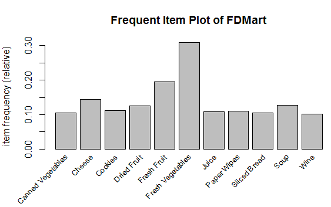

# Pattern-Identification
FDMart is a grocery store dealing with various products of daily needs. Customer visits the store, buys items and a transaction is generated. FDMart specializes in fresh vegetables and fruits. The store is considering expanding its product selection and wants to better understand its customers and their purchasing behaviour. We are provided with a database having 64808 transactions and need to identify interesting patterns. FDMart deals with 106 unique items and we need to do a market basket analysis to identify interesting patterns.  The Marketing Analyst has provided the following patterns as a starting point for analysing the data    

-	Purchase patterns related to beverages (Wine, Beer etc.) 

-	Canned vs Fresh    

-	Small vs large transactions   

-	Other interesting patterns    

-	Weekend vs Weekday purchasing pattern

Before we start our analysis, we need to get familiarized with the transaction pattern. Let’s explore before creating any rules.
Firstly, we split the products based on transaction ID and plot the frequent items that have 10% support i.e. if there are 100 transactions, there will be 10 such transactions which will have these items (Relative Frequency).

